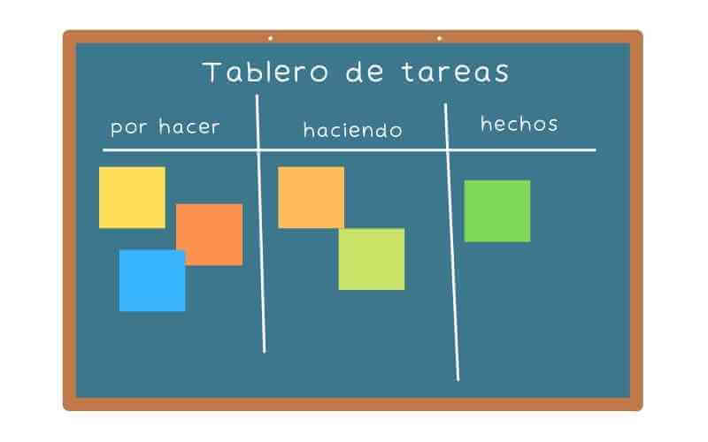

Cuando empezamos a usar Git lo usamos para versionar nuestros proyectos y tener un historial de nuestros avances, y procurando hacer un commit cada cierto avance. Eventualmente  aprendemos de repositorios remotos y de GitHub para guardar nuestros proyectos en la nube 😁. 

Solemos usar nuestros cambios en una sola rama `main` subiendo nuestros cambios un commit después de otro, todo en la misma rama. Bastante sencillo y no nos causa mayores conflictos. 

Pero cuando tenemos un proyecto en equipo debemos adoptar una estrategia diferente y es momento de organizarnos, un método para trabajar de forma ágil y todo fluya donde cada uno avance sin ningún conflicto.

<video src="./we-working-dream.mp4" autoplay muted loop width="400" style="display: block;
  margin: auto;"></video>

Nuestra expectativa a la hora de trabajar en equipo, todos aportando en el proyecto con una armonía perfecta.

Pero eso de tener una sola rama principal `main` para todo desarrollo del proyecto puede funcionar cuando trabajábamos solos, ahora quizás necesitemos de una mejor estrategia. Mientras mas integrantes haya en el proyecto mas complicado será trabajar en equipo, y si no tomamos las medidas necesarias, estaremos así:

<video src="./we-working.mp4" autoplay muted loop width="380" style="display: block;
  margin: auto;"></video>

Cada uno accidentalmente borrando los avances de otro, creando conflictos y errores 😅.

Pero para trabajar en armonía no tenemos que crear una estrategia perfecta, no hay necesidad de recrear la rueda, existen estrategias bastante conocidas como;  Git Flow, GitHub Flow, GitLab Flow, etc.

Cada una teniendo sus pros y contras dependiendo del contexto en el que nos encontremos, así podemos tomar en cuenta algunos factores como:

- el tamaño del proyecto
- El numero de integrantes del equipo
- La confianza y experiencia de cada dev

En este caso nosotros tomaremos la de Trunk based development, ya que es una estrategia bastante sencilla para nuestro caso sin hacer burocrático el procedimiento.


Entonces lo que vamos a hacer es acordar que la rama principal (main) será nuestra rama de referencia. Ahora bien, debemos anotar las tareas pendientes para terminar el proyecto; ojo que estas tareas deben seguir algún criterio [SMART](https://asana.com/es/resources/smart-goals) para realizarse y utilizar alguna metodología ágil y para organizar el estado de las tareas un tablero [Kanban](https://kanbanize.com/es/recursos-de-kanban/primeros-pasos/que-es-kanban) estaría fabuloso.



Y la dinámica es la siguiente:

1. Cada miembro del equipo va tomando una de las tareas 🟧🟥🟩 
2. Quien tome una tarea 🟧 creará una nueva rama destinada únicamente para elaborar esa tarea.  
    
    ```bash
    git branch Rama_de_la_tarea_1
    ```
    
3. Una vez terminada la tarea siguiendo los criterios de aceptación procede a fusionar rama `Rama_de_la_tarea_1` con la rama principal `main`.
    
    ```bash
    git checkout main
    git merge Rama_de_la_tarea_1
    ```
    

Nuestra rama principal será como el tronco de nuestro arbol de commits, algo así como el de la siguiente imagen:


Al crear una rama por cada tarea del proyecto nos evitamos posibles conflictos mientras trabajamos en nuestra tarea asignada. En la anterior imagen vemos con líneas segmentadas cuando queremos fusionar una rama `Rama_de_la_tarea_1` con la rama principal `main`, es decir cuando hacemos merge.

Con esta estrategia podremos trabajar tranquilamente. Siempre podrá existir algún conflicto al momento de hacer merge. Es recomendable mantener nuestra rama `main` de nuestro repositorio local sincronizada con el del repositorio remoto, usando el comando:

```markdown
git pull origin main.
```

Y eso es todo por ahora, iré actualizando esta publicación y cualquier duda, consulta o comentario lo pueden hacer en el servidor de Discord o cualquiera de las otras redes sociales. Hasta Luego 👋